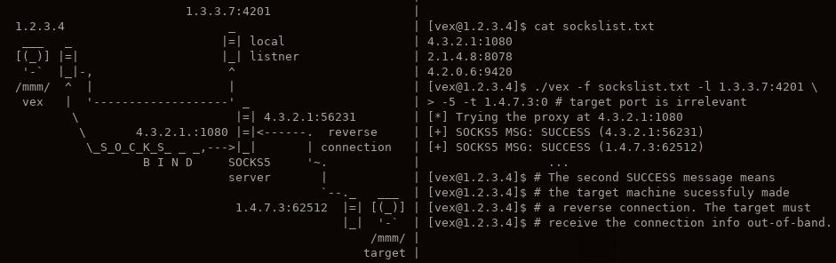

# vex
`vex` is a reverse connection helper for SOCKS4/5. 
`vex` will connect to a remote SOCKS proxy and request it
to `BIND`. The other end of the connection will either be `vex`
binding to a port on the local machine or it connecting to
another listener.


## Building vex
```bash
# to make 
[root@linux] mkdir build && make 

# to clean
[root@linux] make clean
```

## Usage
```
./vex < -f proxy_list > < -l addr:port > [ -t addr:port ] [ -u username ] [ -p password ] [ -5 ] [ -a ] [ -b ] [ -h ]

GENERAL OPTIONS:
  -f	proxy_list	Path to the proxy list. Must be in
			address:port format, one per line.
  -l	addr:port	Local address and port the proxy
			will connect to. With the -b option,
			the proxy will instead bind to this
			address.
  -t	addr:port	Address of the target machine. Defaults
			to the broadcast address and port 0.
  -u	username	Specify a username for SOCKS5 authentication,
			or for the SOCKS4 userid field.
  -b			Instead of connecting to the local address
			bind and listen at that address.
  -h			Display this message.

SOCKS5 OPTIONS:
  -5			Use SOCKS5 protocol (SOCKS4 is the default).
  -a			Use User/Pass Authentication.
  -p	password	Specify a password for SOCKS5 authentication.
```

`vex` expects a proxy-list text file. This file should contain addresses in
`address:port` format, one per-line.
`vex` supports domain names, IPv4, and IPv6. The latter *must* be in the
following format: `[ipv6]:port` (e.g. `[fe80::1337:2]:4201`). 
Domain names are not supported when specifying the target address (via `-t`).

## Examples

### An illustrated SOCKS5 example.



### Requesting BIND with a SOCKS4 proxy. 
In this example `vex` will forward all communications from the bound SOCKS4
proxy to another machine (like in the illustrated example above).
```
[root@linux]$ ./vex -f socks4list.txt -l <another_machine_address>:9999  
[*] Connecting to <proxy_address>:<proxy_port> ... Success.
[*] SOCKS4 MSG: GRANTED (<bound_proxy_address>:<bound_proxy_port>)
```
At this point the reverse connection can be initated to the proxy and will
be forwarded to `<another_machine_address>:9999`. When the reverse connection is
established you will see something like this:
```
[*] SOCKS4 MSG: GRANTED (<incoming_address>:<incoming_port>)
```

### Requesting BIND with a SOCKS5 proxy. 
In contrast to the previous examples, here `vex` will bind to a local port 
(`-b`), rather than connecting to another machine.
```
[root@linux]$ ./vex -f socks5list.txt -l localhost:9999 -t <target_address>:0 -5 -b
[*] Connecting to <proxy_address>:<proxy_port> ... Success.
[*] SOCKS5 MSG: SUCCESS (<bound_proxy_address>:<bound_proxy_port>)
```
At this point the reverse connection can be initated to the proxy and will
be forwarded via `localhost:9999`. When the reverse connection is established 
you will see something like this:
```
[*] SOCKS5 MSG: SUCCESS (<target_address>:<incoming_port>)
```
Note that SOCKS5 proxies often (if not always) requrire a legit target address in the BIND request.
## Notes
This code is still in development stages -- use it at your own risk.

**REMEMBER:** If you get caught doing retarded shit while using `vex` - 
it's your responsibility. Please only use this software for legit purposes.
